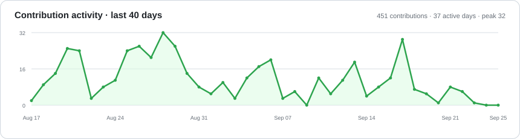

# Hi, I'm qiyi71w

I build desktop software, developer tools, and experiments around AI-assisted development.

## GitHub Metrics

  

## Current Work

  

## Activity

  <picture>
    <source media="(prefers-color-scheme: dark)" srcset="./assets/activity-graph-dark.svg" />
    
  </picture>

  <picture>
    <source media="(prefers-color-scheme: dark)" srcset="./assets/github-snake-dark.svg" />
    
  </picture>

